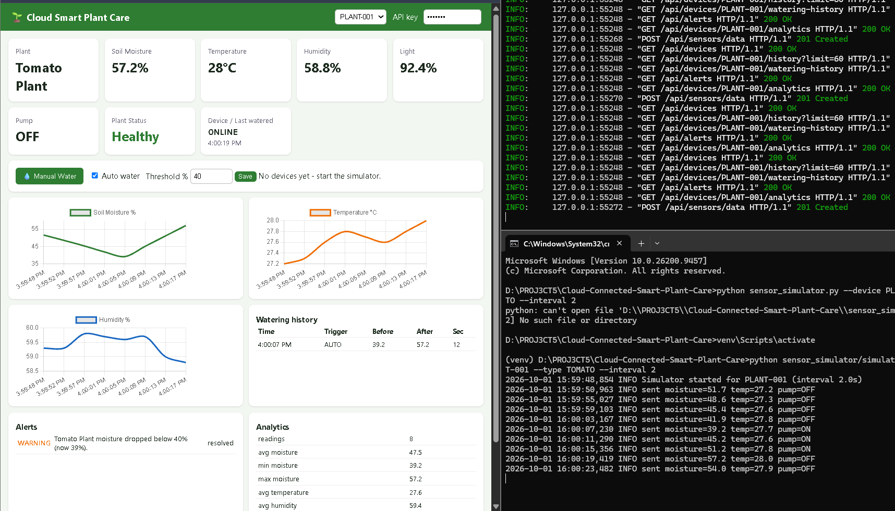
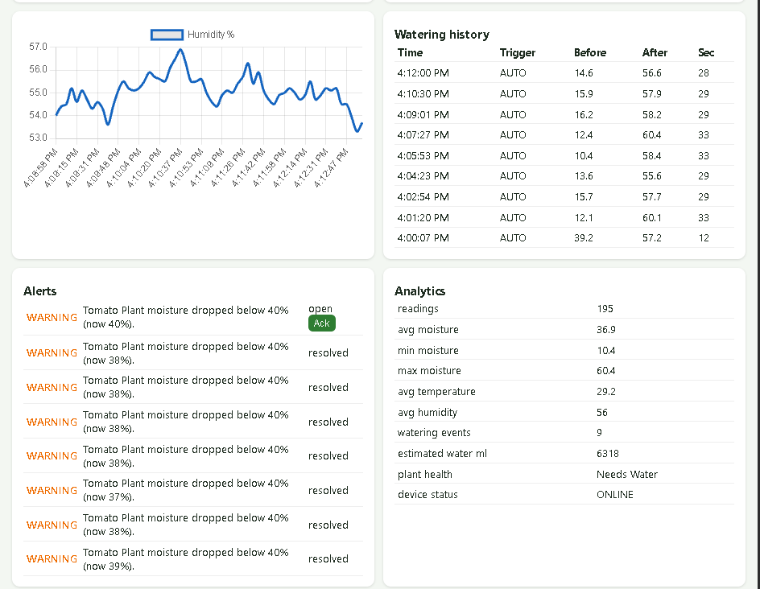
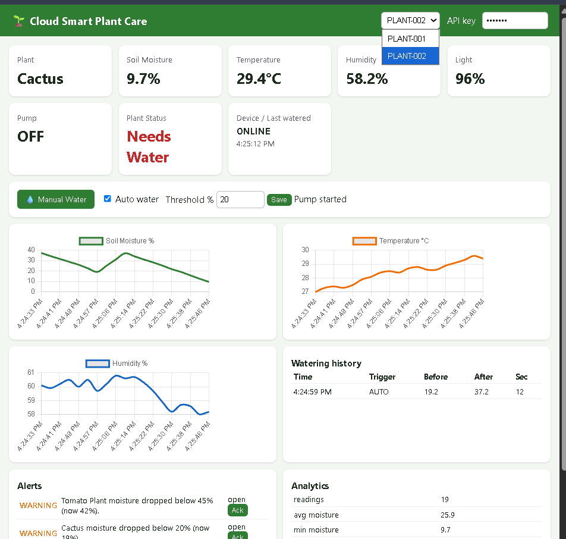
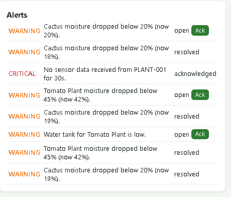

# Cloud-Connected Smart Plant Care & Watering System

Simulated IoT sensors -> REST API (FastAPI) -> database -> automated watering engine -> alerts -> live dashboard.
Runs fully on a laptop with **no hardware**; the simulator can later be replaced by an ESP32 without changing the cloud side.

## Architecture
```
Python Sensor Simulator / ESP32 --HTTPS POST--> FastAPI (API key auth, validation)
   -> SQLite/Postgres (readings, devices, events, alerts)
   -> Watering Engine (threshold + tank + cooldown + max duration)
   -> response {"pump":"ON|OFF"} back to device  |  Dashboard polls API every 3s
```

## Run locally (4 terminals, from repo root)
```bash
python -m venv venv && source venv/bin/activate      # Windows: venv\Scripts\activate
pip install -r requirements.txt
cp .env.example .env                                  # optional; defaults work (API key: dev-key)
uvicorn backend.app:app --reload --port 8000          # backend + dashboard -> http://localhost:8000
python sensor_simulator/simulator.py --device PLANT-001 --type TOMATO --interval 2
python sensor_simulator/simulator.py --device PLANT-002 --plant-name "Cactus" --type SUCCULENT --start-moisture 40
pytest -v                                             # automated tests
```
Watch: moisture 55 -> falls below 40 -> Low-moisture alert -> pump ON -> moisture rises to 55+ -> pump OFF -> event saved.
Offline test: stop the simulator; after 30s the device shows OFFLINE and a CRITICAL alert appears.

## Main API (header `X-API-Key`)
`POST /api/sensors/data` · `GET/POST /api/devices` · `GET /api/devices/{id}` · `/latest` · `/history` · `PUT /threshold` · `POST /water` · `GET /watering-history` · `GET /analytics` · `GET /api/alerts` · `PUT /api/alerts/{id}/acknowledge`
Interactive docs: http://localhost:8000/docs

## Cloud concepts shown
REST API/IoT ingestion, cloud database + time-series history, event-driven automation, alerts, heartbeat/offline detection,
API-key auth, env-based secrets, input validation, idempotent duplicate handling, retry/backoff + buffering, stateless API (horizontally scalable).

## Deploy free (outline)
Render/Railway free web service: start command `uvicorn backend.app:app --host 0.0.0.0 --port $PORT`; set `API_KEY` in host secrets;
for persistent storage swap SQLite for free Supabase/Neon Postgres (only `backend/db.py` changes). Point simulator `--api https://<your-app>`.

## Optional hardware
ESP32 + capacitive soil sensor + DHT22 + relay (low-voltage pump): POST the same JSON to `/api/sensors/data` and switch the relay from the `pump` field of the response.

## Limitations / future
SQLite demo DB, polling instead of WebSockets/MQTT, no per-user login (shared API key), simulated data only.

## Screenshots
Add your images to `screenshots/` (see `docs/RUN_GUIDE.md` for names), then these will display:






Step-by-step instructions: [docs/RUN_GUIDE.md](docs/RUN_GUIDE.md) · Social captions: [docs/SOCIAL_CAPTIONS.md](docs/SOCIAL_CAPTIONS.md)
